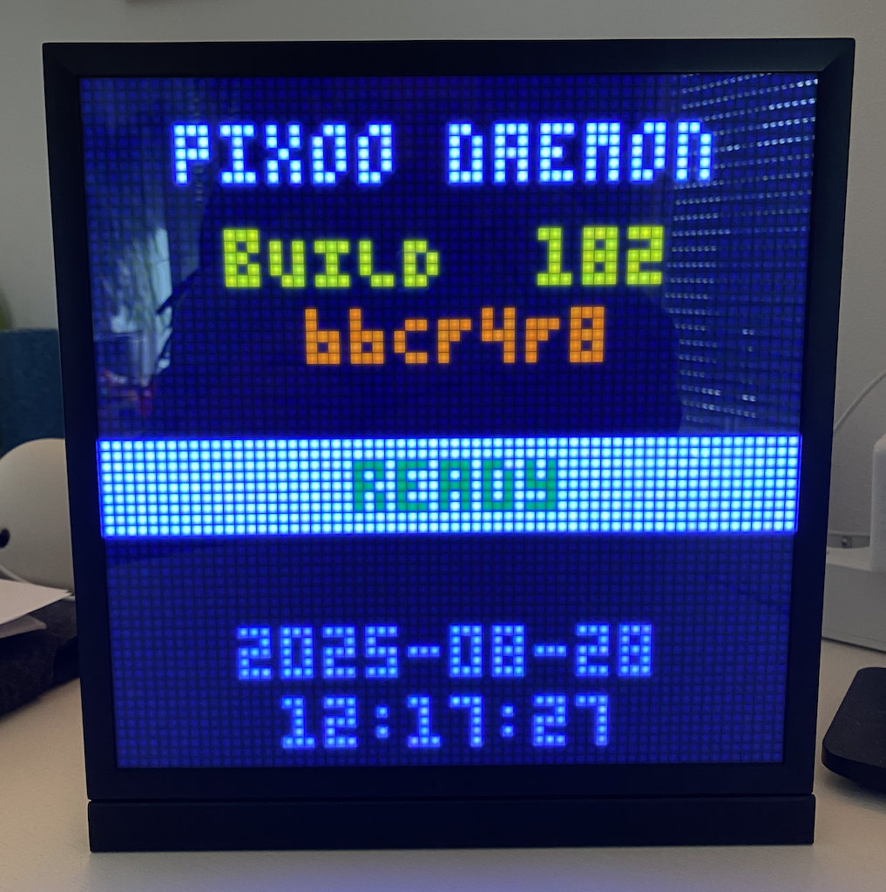

# Pixoo Daemon 🧩💡

<p align="center">
  
</p>

A friendly, MQTT‑driven scene renderer for Divoom Pixoo 64 devices, written in
Node.js. It listens to MQTT messages, manages scenes, and renders pixels like a
tiny digital stage manager (with good manners and logs).

If you enjoy glowing pixels, clean architecture, and positive logs, you’re in a
great place. ✨

---

## Table of Contents

- [Features](#features)
- [Current State](#current-state)
- [Roadmap](#roadmap)
- [Quick Start](#quick-start)
- [Configuration](#configuration)
- [Local MQTT Setup](#local-mqtt-setup)
- [Usage (MQTT commands)](#usage-mqtt-commands)
- [Scenes](#scenes)
- [Architecture Overview](#architecture-overview)
- [Docker & Deployment](#docker--deployment)
- [Development](#development)
- [Troubleshooting](#troubleshooting)
- [Acknowledgements](#acknowledgements)
- [Contributing](#contributing)
- [License](#license)

---

## Features

- Robust scene lifecycle with `init → render → cleanup` hooks
- MQTT control per device (set scene, switch driver, publish metrics)
- Device adapter with hot‑swappable drivers (`mock`/`real`)
- Professional renderers:
  - Advanced charts (negative values, overflow handling, gradients)
  - High‑performance gradient lines with alpha blending
  - Minimal but capable 3x5 bitmap text renderer
- Smart boot handling: init delays, safe clearing on scene switches
- Helpful logs with a positive tone 😇

---

## Current State

This repository is the base implementation for the Pixoo Daemon. It includes
production‑ready components and examples that you can use out of the box:

- ✅ Advanced chart rendering (`lib/advanced-chart.js` + `scenes/advanced_chart.js`)
- ✅ Gradient renderer (`lib/gradient-renderer.js`)
- ✅ Performance utilities (`lib/performance-utils.js`)
- ✅ Animation framework (`scenes/test_draw_api_animated.js`)
- ✅ Enhanced device adapter with boot state management (`lib/device-adapter.js`)

Quality of life:

- ✅ Automatic screen clear on scene switches or `clear: true`
- ✅ Parameter updates without full scene reinit
- ✅ Per‑device metrics published to MQTT

---

## Roadmap

Highlights planned next:

- Scene transitions and scheduling
- Device discovery and health monitoring
- Performance dashboard and scene profiling
- Plugin system for third‑party scenes

---

## Quick Start

Prerequisites:

- Node.js 18+
- An MQTT broker (e.g., Mosquitto)
- A Pixoo 64 reachable on your network

Install and run:

```bash
git clone https://github.com/your-user/pixoo-daemon.git
cd pixoo-daemon
npm install

# Configure MQTT access (examples below) and device targets (see Configuration)

npm start
```

Send your first command (replace the IP with your device):

```bash
mosquitto_pub -h $MOSQITTO_HOST_MS24 -u $MOSQITTO_USER_MS24 -P $MOSQITTO_PASS_MS24 \
  -t "pixoo/192.168.1.159/state/upd" -m '{"scene":"startup"}'
```

You should see the startup scene appear. If not, peek at the logs — they’re
quite talkative.

---

## Configuration

### MQTT connection

Environment variables used by the daemon (see `daemon.js`):

- `MOSQITTO_HOST_MS24` (default: `localhost`)
- `MOSQITTO_USER_MS24`
- `MOSQITTO_PASS_MS24`

Examples:

```bash
export MOSQITTO_HOST_MS24=miniserver24
export MOSQITTO_USER_MS24=smarthome
export MOSQITTO_PASS_MS24=your_password_here
```

### Device targets and drivers

You can point the daemon at one or more devices and specify the driver per IP.

There are two ways to configure this:

1. Code override (fastest for development)

- File: `lib/device-adapter.js`
- Constant: `DEVICE_TARGETS_OVERRIDE`
- Format: `"192.168.1.189=real;192.168.1.159=mock"`

1. Environment variable (recommended for deployment)

- Set `PIXOO_DEVICE_TARGETS` with the same format as above
- Optional fallback: `PIXOO_DEFAULT_DRIVER` (`mock` or `real`, default: `mock`)

Important: If `DEVICE_TARGETS_OVERRIDE` is non‑empty, it takes precedence and it
will ignore `PIXOO_DEVICE_TARGETS` (the logs make this very clear).

### .env file

You can store your local configuration in a `.env` file and export it in your
shell session, or use tools like direnv. See `.env.example` for a template.

---

## Usage (MQTT commands)

Topics the daemon listens to (per device IP):

- `pixoo/<device_ip>/state/upd` — main control channel (set scene + parameters)
- `pixoo/<device_ip>/scene/set` — set default scene name
- `pixoo/<device_ip>/driver/set` — switch driver (`mock`/`real`)
- `pixoo/<device_ip>/reset/set` — soft reset device via HTTP API

What the daemon publishes back:

- `pixoo/<device_ip>/ok` — per‑render metrics and timing
- `pixoo/<device_ip>/metrics` — device metrics snapshot
- `pixoo/<device_ip>/error` — render errors with scene name
- `pixoo/<device_ip>/scene` — current default scene
- `pixoo/<device_ip>/driver` — active driver
- `pixoo/<device_ip>/reset` — reset results

Handy examples (see more in `PIXOO_COMMANDS.md`):

```bash
# Show deployment info
mosquitto_pub -h $MOSQITTO_HOST_MS24 -u $MOSQITTO_USER_MS24 -P $MOSQITTO_PASS_MS24 \
  -t "pixoo/192.168.1.159/state/upd" -m '{"scene":"startup"}'

# Fill with red
mosquitto_pub -h $MOSQITTO_HOST_MS24 -u $MOSQITTO_USER_MS24 -P $MOSQITTO_PASS_MS24 \
  -t "pixoo/192.168.1.159/state/upd" -m '{"scene":"fill","color":[255,0,0,255]}'

# Performance test (adaptive timing)
mosquitto_pub -h $MOSQITTO_HOST_MS24 -u $MOSQITTO_USER_MS24 -P $MOSQITTO_PASS_MS24 \
  -t "pixoo/192.168.1.159/state/upd" -m '{"scene":"test_performance_v3","adaptiveTiming":true}'
```

Tip: Include `"clear": true` in any `state/upd` message to clear the display
before rendering.

---

## Scenes

Core scenes included out of the box:

- `startup` — Deployment info and version display
- `empty` — Clean black screen
- `fill` — Solid color fill (RGBA)
- `advanced_chart` — Professional chart rendering demo
- `test_draw_api` — Draw API showcase
- `test_draw_api_animated` — Animation framework demo
- `test_performance_v2` / `test_performance_v3` — Performance tests

Creating your own scene is easy — see `STANDARDS.md` → Scene Development
Standards and browse the examples in `scenes/`.

---

## Architecture Overview

- `daemon.js` — entrypoint; loads scenes, connects MQTT, routes messages
- `lib/scene-manager.js` — scene lifecycle and per‑scene state handling
- `lib/device-adapter.js` — per‑device driver proxy (`mock` or HTTP `real`)
- `lib/pixoo-http.js` — minimal HTTP renderer for full‑frame pushes
- `lib/advanced-chart.js`, `lib/gradient-renderer.js` — high‑quality renderers

Design notes:

- Scenes keep logic small and focused. Always call `device.push()` after
  drawing.
- Parameter updates don’t force re‑init; they’re merged into scene state.
- Devices have boot‑awareness; newly‑booted devices get a short warm‑up delay.

---

## Docker & Deployment

Build a local image:

```bash
docker build -t pixoo-daemon:local .
```

Run with environment variables:

```bash
docker run --rm -e MOSQITTO_HOST_MS24=broker \
  -e MOSQITTO_USER_MS24=user -e MOSQITTO_PASS_MS24=pass \
  -e PIXOO_DEVICE_TARGETS="192.168.1.159=real" \
  pixoo-daemon:local
```

There’s also a sample compose file under
`other-code/server basics/docker-compose.yml` and server deploy scripts in
`scripts/` — take a look if you’re heading to production.

---

## Local MQTT Setup

Use Mosquitto for local testing.

Install (macOS):

```bash
brew install mosquitto
brew services start mosquitto
```

Create a `.env` with your credentials (or use the example):

```bash
cp .env.example .env
```

`.env.example` contains:

```bash
# MQTT
MOSQITTO_HOST_MS24=localhost
MOSQITTO_USER_MS24=test
MOSQITTO_PASS_MS24=test

# Pixoo devices
# Example: 192.168.1.159=real;192.168.1.189=mock
PIXOO_DEVICE_TARGETS=""
PIXOO_DEFAULT_DRIVER=mock
```

Export for the current shell (fish example):

```fish
for line in (cat .env | string match -v "#*" | string match -r "\S")
  set -l kv (string split -m1 = $line)
  set -x $kv[1] $kv[2]
end
```

---

## Development

Useful scripts:

```bash
npm start              # Run the daemon
npm run build:version  # Update version metadata
npm run lint           # ESLint
npm run lint:fix       # ESLint (auto‑fix)
npm run format         # Prettier write
npm run format:check   # Prettier check
npm run md:lint        # Markdownlint
npm run md:fix         # Markdownlint (auto‑fix)
```

Standards and best practices:

- See `STANDARDS.md` for code quality, docs, testing, and scene guidelines
- DRY, small functions, meaningful names, and clear error handling
- Markdown files should be lint‑clean (we like tidy docs)

Pro tips:

- Use the `mock` driver for fast iteration without a device
- Keep `DEVICE_TARGETS_OVERRIDE` empty in production builds

---

## Troubleshooting

- “No device targets configured …”: Set `PIXOO_DEVICE_TARGETS` or adjust
  `DEVICE_TARGETS_OVERRIDE` in `lib/device-adapter.js`.
- “Connected to MQTT broker as undefined”: Check your
  `MOSQITTO_USER_MS24`/`MOSQITTO_PASS_MS24`.
- Nothing shows on the Pixoo: Ensure the scene calls `await device.push()`; all
  built‑in scenes already do this.
- Intermittent failures on fresh boot: The daemon detects boot and adds a short
  delay — give it a couple seconds.

If you’re stuck, check the logs first — they’re quite helpful and a tad
encouraging. 😄

---

## Acknowledgements

Built with love by Sonic, Cursor, and Markus Barta (mba). Thanks to the
open‑source community and Divoom Pixoo enthusiasts who inspire bright ideas.

Happy pixel pushing! 🚀

---

## Contributing

Contributions are warmly welcome! Please:

- Open an issue to discuss substantial changes
- Follow `STANDARDS.md` for code quality and scene development
- Keep PRs focused and well‑described (we love good commit messages)

If you’re unsure, open a draft PR and we’ll figure it out together. 😄

---

## License

MIT License — do good things, be kind, and give credit where due.
